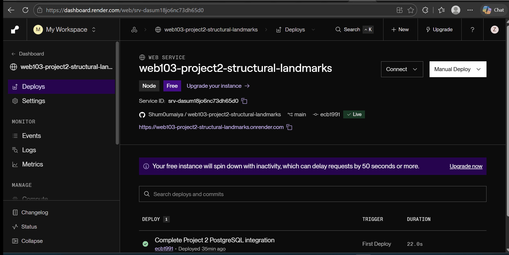

# WEB103 Project 2 - Structural Landmarks

Submitted by: **Sumaiya Shumu**

About this web app: **Structural Landmarks is an interactive engineering listicle that showcases five remarkable structures from around the world. In this version of the project, the landmark data is stored in a PostgreSQL database hosted on Render and retrieved through an Express API. Users can explore each landmark and view information about its structural type, location, materials, year of completion, dimensions, and engineering significance.**

Time spent: **6** hours

## Required Features

The following **required** functionality is completed:

<!-- Make sure to check off completed functionality below -->

- [x] **The web app uses only HTML, CSS, and JavaScript without a frontend framework**
- [x] **The web app is connected to a PostgreSQL database, with an appropriately structured database table for the list items**
  - [ ] **NOTE: The walkthrough added to the README includes a view of the Render dashboard demonstrating that the PostgreSQL database is available**
  - [ ] **NOTE: The walkthrough includes a demonstration of the database table contents using `SELECT * FROM landmarks;`**

## Optional Features

The following **optional** features are implemented:

- [ ] The user can search for items by a specific attribute

## Additional Features

The following **additional** features are implemented:

- [x] Data for all five structural landmarks is stored in a PostgreSQL database
- [x] Added an Express API endpoint for retrieving all landmarks from PostgreSQL
- [x] Added an Express API endpoint for retrieving an individual landmark by slug
- [x] Each landmark has a unique detail page
- [x] Added responsive landmark cards for desktop and mobile devices
- [x] Added custom illustrations for each engineering landmark
- [x] Added engineering information including location, year completed, structural type, material, dimensions, and engineering lessons
- [x] Added a custom 404 page for invalid routes
- [x] Deployed the web application using Render
- [x] Connected the deployed Render web service to the Render PostgreSQL database
- [x] Added a modern engineering-inspired dark interface

## Video Walkthrough

Here's a walkthrough of implemented required features:

GIF created with **ScreenToGif**

<!-- Recommended tools:
[Kap](https://getkap.co/) for macOS
[ScreenToGif](https://www.screentogif.com/) for Windows
[peek](https://github.com/phw/peek) for Linux.
-->

## Notes

One of the main challenges in this project was converting the original listicle from hard-coded JavaScript data to data stored in a PostgreSQL database.

I learned how to create and seed a PostgreSQL table, connect a Node.js and Express backend to the database using the `pg` package, and retrieve database records using SQL queries.

I also learned how to create API routes that return PostgreSQL data and how the frontend can use `fetch()` to request that data and dynamically display it on the webpage.

Another challenge was keeping the frontend compatible with the database because PostgreSQL uses column names such as `year_completed`, `primary_material`, and `engineering_lesson`, while the original frontend used JavaScript properties such as `yearCompleted`, `primaryMaterial`, and `engineeringLesson`.

This project helped me better understand the connection between PostgreSQL, Node.js, Express, API routes, SQL queries, and frontend JavaScript.

## License

Copyright 2026 Sumaiya Shumu

Licensed under the Apache License, Version 2.0 (the "License");
you may not use this file except in compliance with the License.
You may obtain a copy of the License at

> http://www.apache.org/licenses/LICENSE-2.0

Unless required by applicable law or agreed to in writing, software
distributed under the License is distributed on an "AS IS" BASIS,
WITHOUT WARRANTIES OR CONDITIONS OF ANY KIND, either express or implied.
See the License for the specific language governing permissions and
limitations under the License.